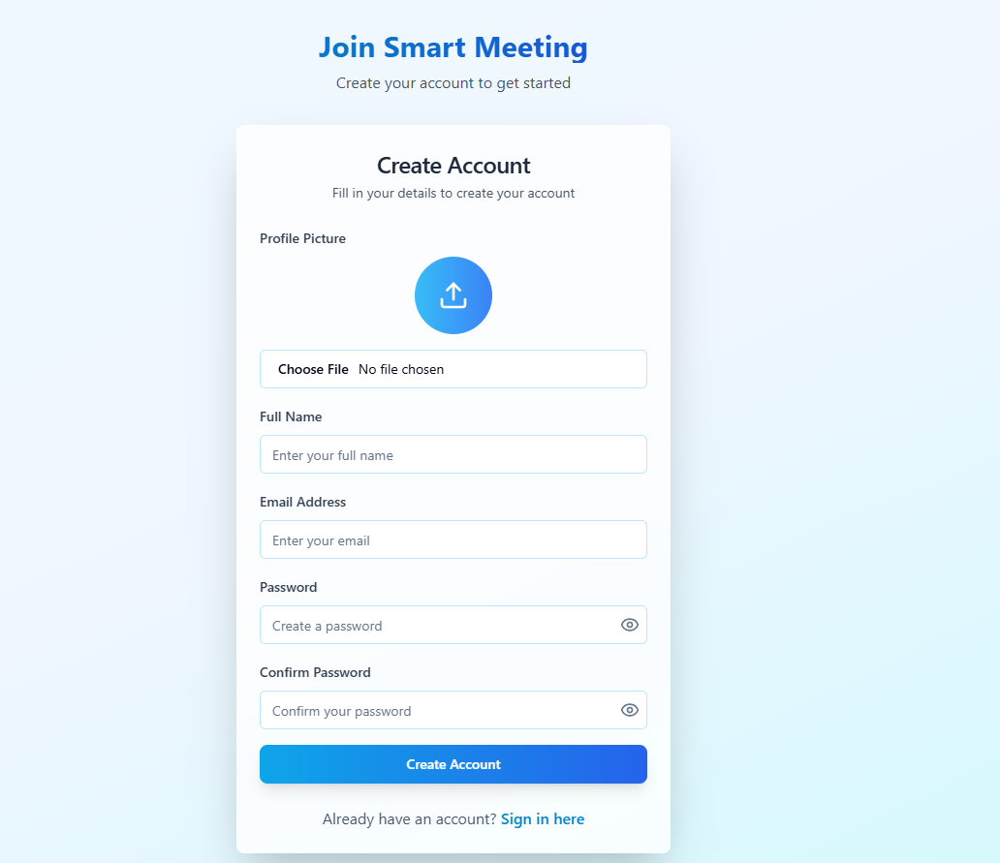
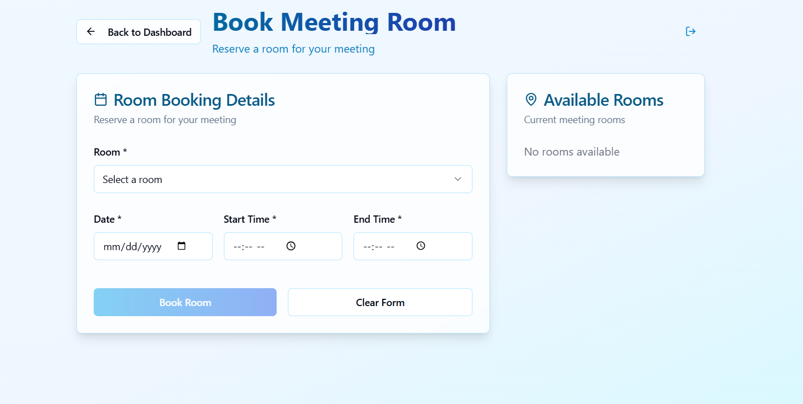
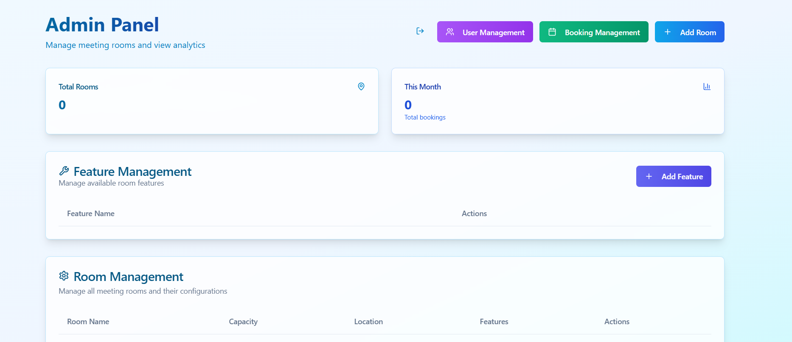

# Smart Room Management System

A multi-role web platform for booking meeting rooms, managing meetings, and capturing Minutes of Meeting (MoM) within organizations.

Built as part of a real-world internship project to streamline room scheduling, meeting coordination, and post-meeting documentation across teams.

## Problem

In many organizations, meeting room booking, meeting coordination, and documentation are handled through disconnected tools,
emails, or spreadsheets. This leads to double bookings, lack of visibility, and inconsistent follow-up
on decisions and action items.

Teams waste time coordinating logistics instead of focusing on outcomes, and important context from meetings is often lost
across personal notes and messaging tools.

## Solution

This platform centralizes room booking, meeting management, and Minutes of Meeting into a single system with clear workflows
and role-based access. It provides a shared source of truth for room availability, meeting details, and post-meeting outcomes,
helping teams coordinate more efficiently and maintain consistent documentation across the organization.

By bringing scheduling, meetings, and follow-ups into one place, the system reduces coordination overhead, prevents conflicts,
and improves visibility for both day-to-day users and administrators.

## Key Capabilities

- Role-based access with separate experiences for administrators and end users
- End-to-end room booking workflows with availability checks and scheduling controls
- Meeting management with agendas, attendees, and structured Minutes of Meeting (MoM)
- Centralized tracking of decisions and action items to support follow-up and accountability
- Administrative oversight for rooms, users, and booking activity with operational visibility

## System Architecture

The system is designed as a modular, role-based web application with a clear separation between user-facing workflows
and administrative management. Core domains such as rooms, bookings, meetings, and Minutes of Meeting are modeled
as first-class entities, enabling consistent behavior and validation across the platform.

The architecture emphasizes clear boundaries between concerns, allowing booking logic, meeting management, and
documentation workflows to evolve independently while remaining part of a cohesive system.

## Tech Stack

- Backend: Server-side application responsible for authentication, role-based access control, booking logic, and data validation
- Frontend: User-facing web interface for room browsing, bookings, meetings, and Minutes of Meeting management
- Database: Relational database for persistent storage of users, rooms, bookings, meetings, and MoM records
- Authentication & Authorization: Role-based access to separate administrative workflows from regular user flows

### Technologies Used

- Backend: Laravel (RESTful APIs for authentication, room booking, meetings, and MoM workflows), tested using Postman
- Frontend: React with Tailwind CSS for building responsive, role-based user interfaces
- Database: MySQL for relational data storage

## Setup & Run

To run the project locally, you will need a standard web development environment with PHP, Node.js, and a relational database.

High-level setup steps:
1. Clone the repository
2. Install backend dependencies and configure environment variables
3. Run database migrations and seed initial data
4. Install frontend dependencies and start the development server
5. Access the application through the local development URL

## Demo & Screenshots

### Authentication

### Room Booking

### Admin Panel

Screenshots and a short walkthrough of the system will be added here to showcase the main user flows,
including room booking, meeting management, and Minutes of Meeting workflows.

